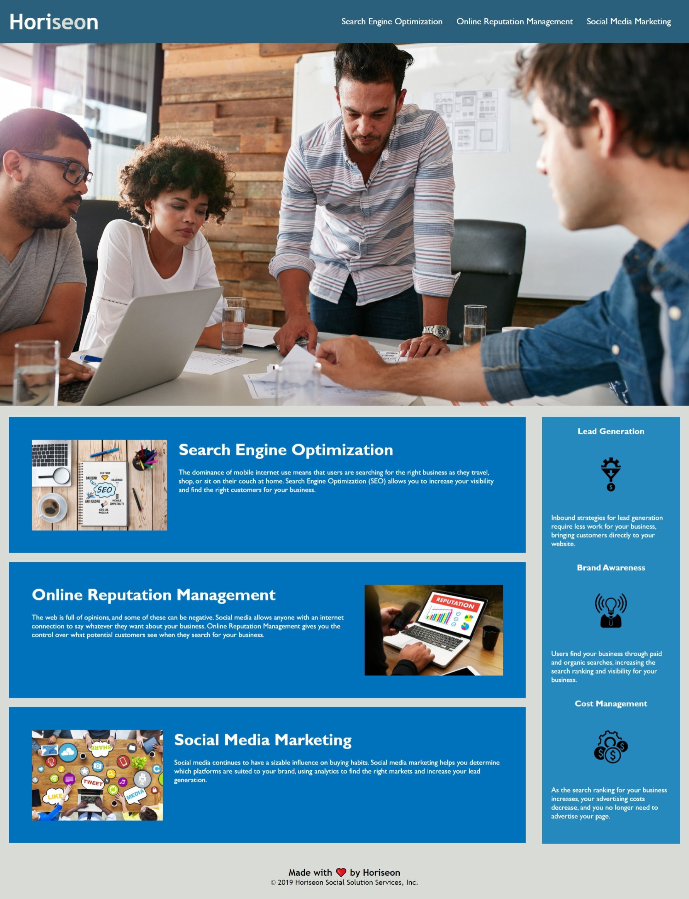

# Horiseon Goes Big

## Description

As a marketing agency, Horiseon required a codebase that follows accessibility standards so their site is optimized for search engines. The codebase has been enhacened for long-term sustainability by...
* Updated the tite so the website tab displayed the page name Horiseon.
* Added a meta viewport element to gives the browser instructions on how to control the page's dimensions and scaling.
* Consilidating the selectors and propeties in the CSS which increased efficiency. 
* The semantic structure of the HTML has been organized and commented for transparacency.

## Visuals
This is how th deployed Horiseon website will look

 
## Usage
<!-- This text is Italics -->
*Utalize the Horiseon webpage through it's navigation bar located in the header.*
<!-- Provide the navigation links in list format -->
* Clicking on Search Engine Optimization in the navigation will link you to that section of the Horieon webpage...

 

* Clicking on Online Reutation Management in the navigation will link you to that section of the Horieon webpage...

* Clicking on Social Media Marking in the navigation will link you to that section of the Horieon webpage...

## Support
For help with this webpage please contact 
|Name       | Email                     |
|-----------|---------------------------|
|Lynn Sadler| lynnadelesadler@yahoo.com |

## Roadmap
Check back to this page frequently as we continue to make updates and enhacements!

## Authors and acknowledgment

*Acknowledgement for this webage...* 

**Sourcecode credit to be given to © 2022 Trilogy Education Services, LLC, a 2U, Inc. brand. Confidential and Proprietary. All Rights Reserved.**

**Optimized codebase that follows accessibility standards credit given to Lynn Sadler.**

## License
N/A
